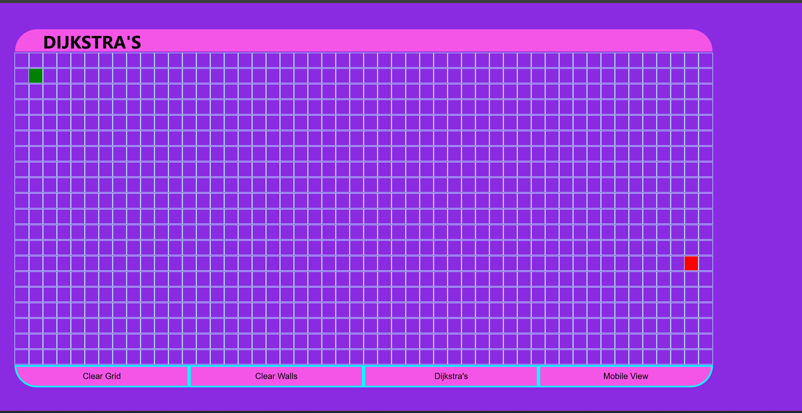
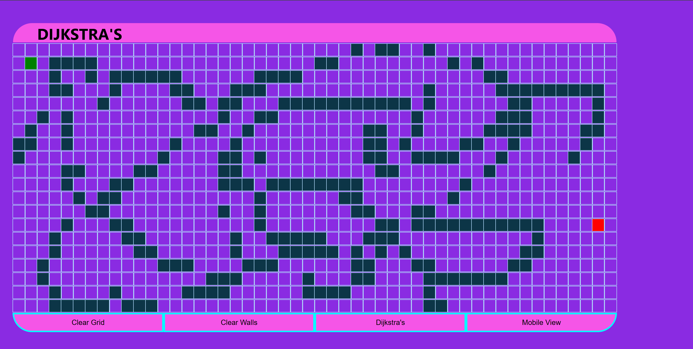
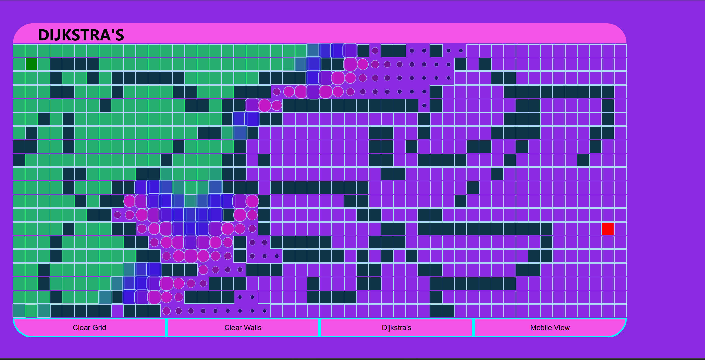
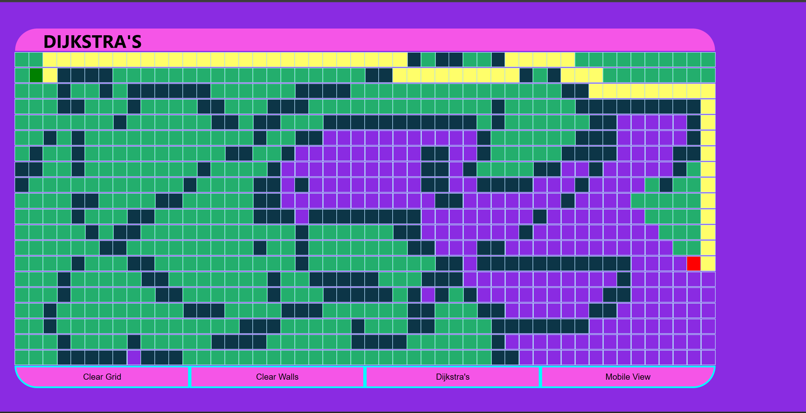
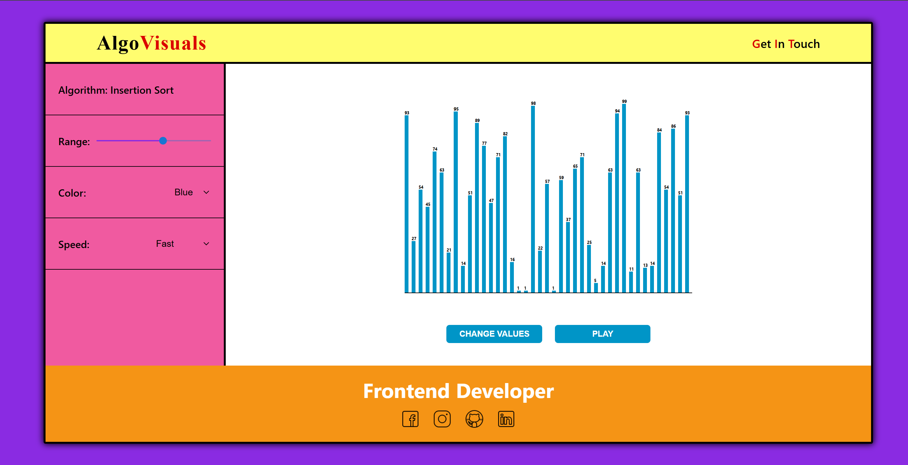
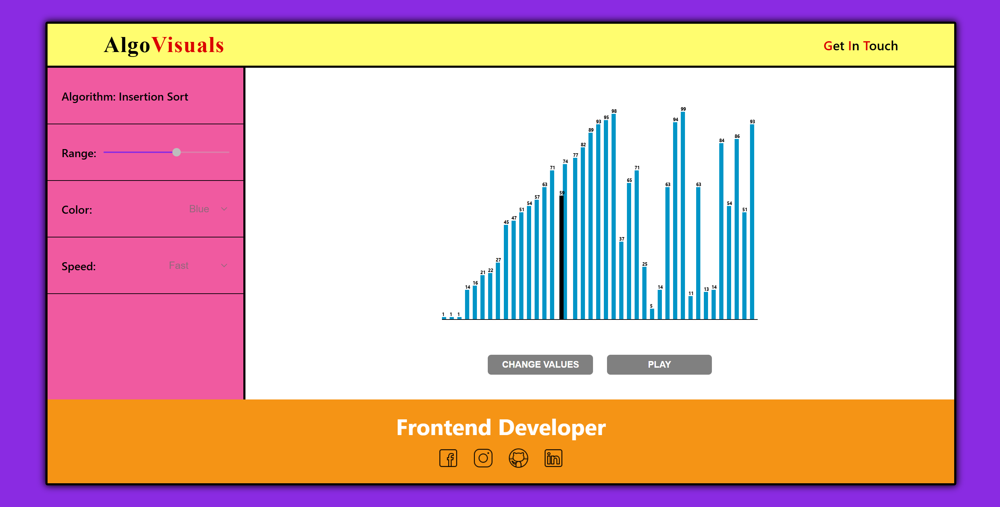
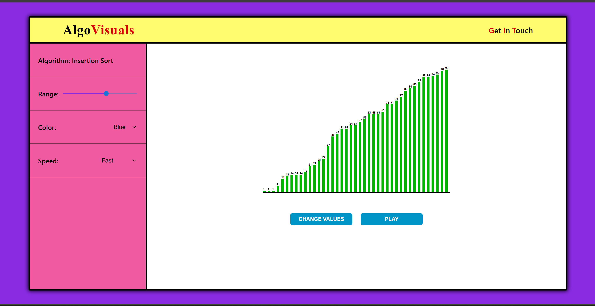

# All-Go-Visual 🚀

An interactive, web-based full-stack visualization platform designed to help new learners master data structures and algorithms in a deeply visual and intuitive way. By converting abstract theoretical code into real-time, fluid grid and array animations, **All-Go-Visual** bridges the gap between complex computer science theories and practical development.

---

## 🎨 Core Application Functionality

* **Dual-Engine Workspace:** Switch seamlessly between **Pathfinding Grid Layouts** (graph theory) and **Sorting Dashboards** (array manipulation).
* **Dynamic Node & Element Sandbox:** * Click and drag across the grid to draw custom maze barriers (walls) in real-time.
  * Drag and reposition the *Start* and *Finish* nodes interactively to test algorithm efficiency instantly.
* **Responsive Layout Controls:** Built-in display modes with instant context switching:
  * **Desktop View:** Features an expansive $20 \times 50$ grid canvas for intricate maze paths.
  * **Mobile View:** Gracefully downgrades to a compact $10 \times 20$ grid to remain lightweight and readable on small screens.
* **Direct-DOM Visualizer Engine:** High-performance rendering pipeline that bypasses heavy React state re-render cycles during tight execution loops. It directly updates structural DOM elements paired with hardware-accelerated CSS3 animations to guarantee buttery-smooth playback speeds.
* **One-Click State Management:** Clean operational handlers allowing you to clear search histories while keeping custom wall patterns, wipe the grid completely clean, or reshuffle random data sets.

---

## 📺 User Interface & Application Flow

### 📍 Pathfinding Visualizer Lifecycle
See how the grid environment shifts dynamically from configuration to execution:

1. **Initial Workspace Setup:** The clean, unvisited default grid matrix canvas.
   

2. **Obstacle Mapping:** Custom walls and maze barriers painted onto the board via click-and-drag mechanics.
   

3. **Active Traversal Execution:** Real-time rendering of the node queue expanding outwards across the matrix plane.
   

4. **Final Shortest Path Outcome:** The destination node is successfully found, and the absolute shortest route is illuminated via backtracking history.
   

---

### 📊 Sorting Visualizer Lifecycle
Track the visual states of array reorganization during performance operations:

1. **Initial Unsorted Deck:** The starting UI environment populated with a randomized array structure.
   

2. **Active Sorting Execution:** Real-time visual comparison updates showing array bars rapidly shifting positions.
   

3. **Sorted Array Confirmation:** The definitive completion state confirming all elements have successfully reached sequential order.
   

---

## 🧠 Deep-Dive: Algorithmic Breakdown

### 📍 Pathfinding & Graph Traversal Engines
These algorithms discover structural routing paths on a 2D coordinate plane using dedicated tracking parameters:

* **Dijkstra’s Algorithm:** The unweighted industry benchmark for pathfinding; expands uniformly in all directions to guarantee the absolute shortest path.
* **A\* (A-Star) Search:** An optimized, heuristic-driven variant of Dijkstra that uses Manhattan Distance estimations ($|x_1 - x_2| + |y_1 - y_2|$) to reach destinations with significantly reduced execution cycles.
* **Breadth-First Search (BFS):** Explores structural layers uniformly level-by-level, ensuring the absolute shortest path on unweighted graph layouts.
* **Depth-First Search (DFS):** Traverses deeply down isolated structural branches before backtracking; standard for demonstrating alternative route tracing.

---

### 📊 Array Sorting Engines
These operations process data array elements systematically to reorganize values into absolute ascending sequence:

* **Bubble Sort:** A foundational comparison-based loop that steps through arrays sequentially, comparing adjacent elements and swapping them until the largest elements "bubble up" to the end.
* **Selection Sort:** Segments the collection into sorted and unsorted sections, scanning the unsorted block to isolate the absolute minimum element and shifting it to the front.
* **Insertion Sort:** Mimics the natural logic of sorting playing cards; processes elements sequentially and slots each item backward into its definitive indexed position.
* **Quick Sort:** A rapid "Divide and Conquer" routine that partitions collections around a target **pivot** element, recursively arranging lower variables to the left and higher variables to the right.
* **Merge Sort:** A stable split-and-merge configuration that continually divides array depths down to individual single-element arrays before rebuilding them in chronological sequence.

---

## 🛠️ Tech Stack & Architecture

* **Frontend Engine:** React.js (Class-based deterministic state orchestration).
* **Styling & Motion Core:** Native CSS3 `@keyframes` transitions (`scale` transforms combined with responsive color-interpolation maps).

```text
├── algorithms/                 # Core Algorithmic Mathematics
│   ├── dijkstra.js             # Shortest path exploration logic
│   ├── aStar.js                # Heuristic routing engine
│   ├── bfs.js                  # Layer-by-layer graph traversal
│   ├── dfs.js                  # Deep-dive stack explorer
│   ├── bubbleSort.js           # Bubble Sort algorithm sequence
│   ├── selectionSort.js        # Selection Sort minimum mapping
│   ├── insertionSort.js        # Sequential shift-insertion logic
│   ├── quickSort.js            # Pivot partitioning recursive engine
│   └── mergeSort.js            # Divide-and-conquer array merger
└── PathfindingVisualizer/      # Interactive Visual Canvas Components
    ├── Node/
    │   ├── Node.jsx            # Individual cell grid templates
    │   └── Node.css            # Scale changes and neon animation colors
    ├── PathfindingVisualizer.css # Main control panel layouts
    ├── PathfindingVisualizer.jsx  # Dijkstra Interactive Router
    ├── PathfindingVisualizer1.jsx # A* Canvas Interface
    ├── PathfindingVisualizer2.jsx # BFS System Interface
    └── PathfindingVisualizer3.jsx # DFS Tracking Dashboard